UVR1611 Data Logger Pro (Revived 2019)
======
All credits to https://github.com/berwinter/uvr1611. I just made some PHP7 and Raspi adjustments.

 

Der *UVR1611 Datalogger Pro* ist ein webbasierender Datenlogger für die Universalregelungen UVR1611 und UVR16x2. Die Daten werden mit Hilfe des BL-NET oder CMI über den CAN oder DL abgerufen.

EDIT 2019
-----
Ich habe mich dem Programm angenommen, um es auf einem Raspberry-Pi 2019 mit PHP7 und einer CMI zu betreiben. Für alle anderen Konfigurationen kann ich keine Hilfestellung geben. Alle Anleitungen wurden angepasst, so dass es Möglich sein sollte, das Projekt in gleicher oder ähnlicher Umgebung zu betreiben.

Die Features sind:
* UVR1611 oder UVR16x2
* BL-Net oder CMI
* Datenlogging über CAN-Bus und DL in eine MySQL Datenbank
* Web-Interface
* Animiertes Online-Schema (Elemente und Farben)
* Schema Historie
* Temperaturkurven (Tages und Wochenansicht)
* Leistungskurven (Tages und Wochenansicht)
* Ertragsdiagramme (Monats und Tagesgruppierung)
* Übersichtstabellen zu den Diagrammen
* Öffentliche und private Diagramme
* Monatliche Trendwerte
* Aktuelles Wetter

Vorteile der Anwendung
------

Der BL-Net (und auch das CMI) besitzt nur eine begrenzte Speicherkapazität und die Heizungsdaten müssen deshalb regelmäßig – manuell – ausgelesen werden, damit sie nicht verloren gehen. Der direkte Webzugriff auf den BL-Net/CMI durch externe Nutzer ist in mehrfacher Hinsicht unvorteilhaft (Sicherheit und Überlastung). Das Speichern und Auslesen der Daten aus der SQL Datenbank verhindert diese Problematik.

I Installation
------

Für die Anwendung wird ein Webserver mit PHP und ein MySQL Datenbank-Server benötigt. Die benötigten Pakete können unter Debian/Ubuntu mit folgendem Befehl installiert werden:

	sudo apt-get update
	sudo apt-get upgrade
	sudo apt-get install lighttpd php7.0-cgi mysql-server mysql-client php7.0-mysql php7.0-curl
	sudo lighttpd-enable-mod fastcgi-php
	sudo service lighttpd force-reload

Danach kann die Anwendung in den Ordner `/var/www/` kopiert werden. 

II MySQL User anlegen
------
	sudo mysql
	CREATE USER 'uvr1611'@'localhost' IDENTIFIED BY 'password';
	GRANT ALL PRIVILEGES ON * . * TO 'uvr1611'@'localhost';
	
	GRANT ALL PRIVILEGES ON * . * TO 'root'@'192.168.178.%' IDENTIFIED BY 'PASS';

III Konfiguration
------

Die Konfiguration des Datenloggers erfolgt über die Datei `config/config.ini`:
Diese Datei muss erstellt werden: config/config.ini.example in config/config.ini umbenennen
 
	[mysql]
	server = localhost
	user = uvr1611
	password = uvr1611
	database = uvr1611
	
	[uvr1611]
	logger = "cmi"
	address = 10.0.0.100
	port = 80
	reset = false
	blnet_login = false
	http_port = 80
	
	[app]
	name = "Solar/Heizung Datenauswertung"
	email = bertram.winter@gmail.com
	chartcache = 600
	latestcache = 60
	reduction = 2

Im Abschnitt `mysql` befinden sich die Parameter für den Zugang zur Datenbank. Der angebene Datenbank-Benutzer benötigt die Rechte `DELETE`, `EXECUTE`, `INSERT`, `SELECT`, `SHOW VIEW` und `UPDATE` für die Datebank. Im Abschnitt `uvr1611` wird der `logger` angegeben (`bl-net` oder `cmi`). Weiters bedindet sich hier die IP-Adresse für den BL-NET/CMI. Früher (evtl noch bei alten CMI-Firmwares), verwendete man Port 40000 für die Datenabfrage. Bei meiner CMI mit OS-Version 1.33.3 nimmt man einfach den Port 80. Mit dem Schalter `reset` kann das Löschen der Daten vom BL-NET nach dem Logging aktiviert werden. Der Bereich `app` legt Einstellungen zur Anwendung fest. Anwendung fest. Unter `name` kann der Eintrag „Solar/Heizung Datenauswertung“ durch einen individuellen Eintrag ersetzt werden, ebenso der Eintrag unter `email`. `chartcache` und `latestcache` legen den Zeitraum in Sekunden fest, in dem keine neuen Daten vom Bootloader geholt werden. `reduction` reduziert die Daten in den Diagrammen um den angegebenen Faktor.

Datenbank
------

Zum Erstellen der Datenbankstruktur kann das Skript `install.php` verwendet werden. Dieses Skript überprüft die Information zur Datenbankverbindung aus der Datei `config/config.ini`. Nach dem Anlegen der Datenbankstruktur, können Beispiel Daten in die Datenbank geschrieben werden, um die spätere Einrichtung des Datenloggers zu vereinfachen. Nach der Installation, muss die Datei install.php **unbedingt** gelöscht werden, um unberechtigte Zurgriffe auf die Datenbank oder den Datenlogger zu verhindern!

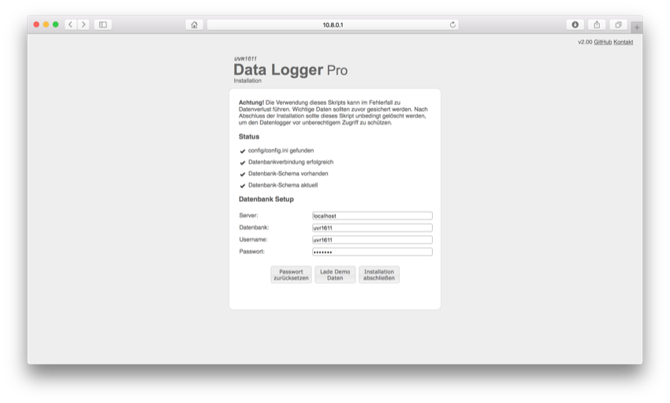

Standort Wetter
------

Mit dem Datenlogger können auch aktuelle Wetterinformationen angezeigt werden. Dazu muss in der Datenbank in der Tabelle `t_menu` ein Eintrag vom Typ `weather` erstellt werden. In der Spalte `schema` ist der gewünschte Ort einzutragen. Die Daten werden von [openWeatherMap](http://openweathermap.org) abgerufen.

Automatisches Abrufen der Daten
------
Damit die Daten automatisch vom BL-Net/CMI geholt werden, muss ein cron-Job mit folgendem Inhalt eingerichtet werden (z.B.: als `/etc/cron.hourly/uvr1611-logger`): 

	#!/bin/bash

	wget 'http://localhost/uvr1611/analogChart.php' -O /dev/null
	
Die Einrichtung des cron-Jobs ist abhängig vom Betriebssystem des Servers und muss entsprechend angepasst werden. 
Sollten die Daten auch weiterhin über WinSOL ausgelesen werden, ist zu beachten, dass bei der Löschung des Datenspeichers in der Konfigurationsdatei deaktiviert werden muss (`reset = false`)

Login und Freigabe
------

Standardmäßig sind die Diagramme nur für angemeldete Benutzer sichtbar. Das Standard-Passwort ist `1234` und sollte unbedingt nach dem Setup durch Aufrufen des Scripts `changePassword.php` geändert werden. Die Berechtigungen für einzelne Charts können in der Tabelle `t_menu` angepasst werden. Dazu muss für das jeweilige Diagramm das Feld `view` auf `yes` gesetzt werden. Als angemeldeter Benutzer hat man auch die Möglichkeit die Diagramme direkt zu bearbeiten und Linien per Drag & Drop hinzuzufügen. 

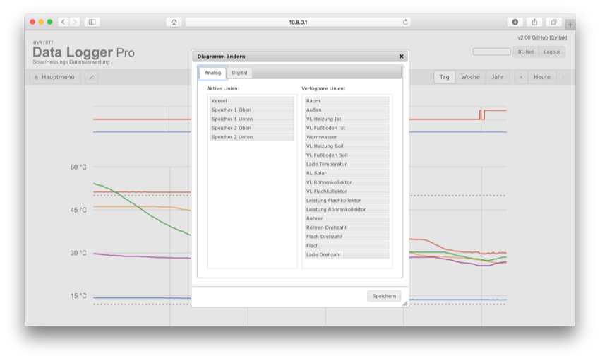

Differenzen (Spreizung)
------

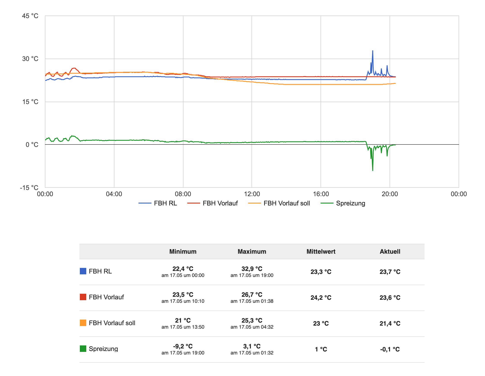
Es ist auch möglich, sich Differenzen in den Diagrammen anzuzeigen, etwa die Differenz aus der Vorlauf- und der Rücklauftemperatur, um sich so eine Spreizung anzeigen zu lassen. Dies erfordert allerdings etwas Handarbeit.
In der Tabelle `t_data` existiert eine Spalte `substraction1`, welche als berechnete Spalte definiert ist. Das CREATE-Table Fragment sieht zum Beispiel folgendermaßen aus:

	  `substraction1` float AS (analog10 - analog8) VIRTUAL,

Das muss man natürlich an seine eigenen Gegebenheiten anpassen. Die SQL-Query hierfür sieht so aus:

	Alter TABLE `t_data` 
	MODIFY COLUMN substraction1 FLOAT
	AS (SPALTE1 - SPALTE2);

Anschließend kann man den virtuellen Kanal `substration1` einfach wie jeden anderen benutzen. So kann man sich auch mehrere Differenzen oder sonstige berechneten Werte anzeigen lassen. Wichtig ist nur zu beachten, dass auch die Tabellen `t_names`, t_names_of_charts`und `t_schema` geändert werden, da hier Spalten existieren, deren Zelle `type` die Bezeichnungen der Kanäle (analog1, analog2 ,...) als enums vordefiniert haben. Hier müssen die neuen Bezeichner eingepflegt werden.

Anpassen der Anwendung
------

Zuerst empfield es sich die Schema-Grafiken an die eigenen Verhältnisse anzupassen, indem diese Dateien mit einem entsprechenden Grafik Programm bearbeitet werden. Das Freeware Programm Inkscape für PC und Mac eignet sich sehr gut, weil das Festlegen der ID’s besonders einfach ist. Die ID’s werden später in der Tabelle `t_schema` benötigt und nachstehend wird kurz gezeigt, wie diese festgelegt werden.
Nachdem die Grafik angepasst wurde, setzt man mit dem Texttool an den Stellen im Diagramm, wo später z.B. die Temperatur angezeigt werden soll ein `? ° C`, klickt mit der rechten Maustaste auf dieses Objekt und es öffnet sich das nachstehende erste Fenster. Dort wird *Object Properties* angeklickt und das rechte Fenster erscheint. In diesem Fenster legt man mit einer freien Bezeichnung die *ID* und das *Label* fest. Im Beispiel ist die ID `vl2_temp` und das Label `#vl2_temp`. Der Label Eintrag wird später in der Tabelle `t_schema` unter `path` eingetragen.

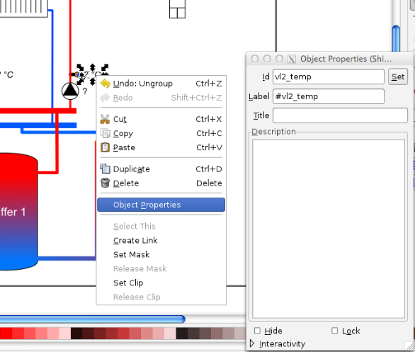

Sind alle ID’s festgelegt, wird diese Datei im Ordner unter `images` gespeichert.

#### t_menu ####

In dieser Tabelle wird die Haupteingangsseite festgelegt. `name` und `order` sind frei festlegbar, wobei `order` die Reihenfolge der einzelnen Darstellungen in der Haupt-Menu Anzeige festlegt.
Werden einzelne Bereiche nicht benötigt, können diese Reihen einfach in der Tabelle gelöscht werden.

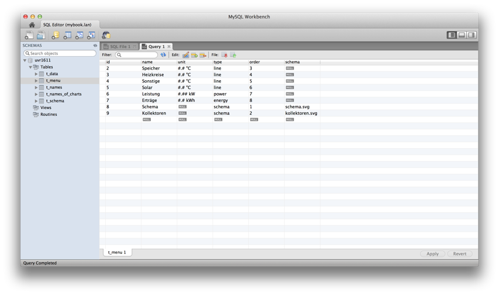

#### t_names ####

In der Spalte `type` wird die aktuelle Belegung der 16 analogen UVR Sensoren Eingänge eingetragen. Unter `name` kann man angeben, welcher Eingang hier geschaltet ist. Nicht benötigte Eingänge werden wieder einfach reihenweise gelöscht.

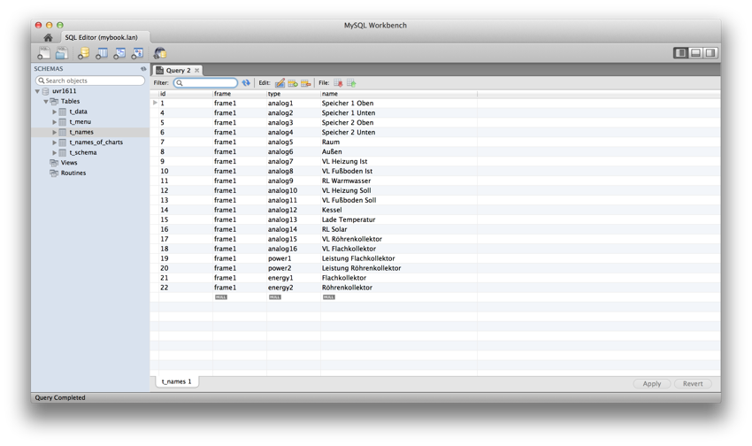

#### t_names_of_charts ####

In dieser Tabelle wird festgelegt, welche Diagramme erzeugt werden sollen. Dabei wird mit der `chart_id` festgelegt, in welchem Chart welche Größen angezeigt werden sollen. Mit `order` wird bestimmt an welcher Stelle im Chart und der darunter liegenden Tabelle ein Wert angezeigt werden soll.
Soll ein Wert in mehreren Charts angezeigt werden, so muss dieser Wert entsprechend oft in `t_names_of_charts` aufgeführt werden. Im nachstehenden Beispiel ist das z.B. die Größe `analog12`. Dieser Wert wird sowohl im Chart 2 des Hauptmenues, als auch im Chart 4 angezeigt

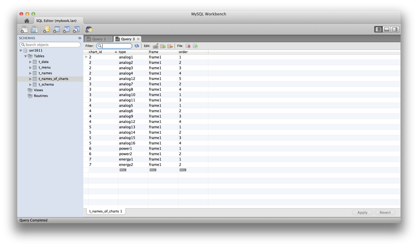

#### t_schema ####

Hier werden die Label-Einträge - wie vorstehend - erläutert eingetragen. Auch die Pumpen, Mischer und Ventil Einstellungen können hier festgelegt werden. Im nachstehenden Beispiel sind dies die digital-Einträge unter `type`. Im Schema erscheinen diese Einträge dann mit ihren aktuellen Zustand `EIN` oder `AUS`.

Als Formatierung kann die Anzahl der Kommastellen angegeben werden (zB.: #.## für 2 Kommastellen). Für die digitalen Ausgänge kann die Funktion `DIGITAL()` verwendet werden um EIN bzw. AUS im Schema anzuzeigen. Für Ventile und Mischer gibt es die Funktionen `MISCHER_AUF()`, `MISCHER_ZU()` und `VENTIL()`. Mischer zeigen den aktuellen Zustand AUF/ZU an und im Ruhezustand erfolgt keine Anzeige. Ventile zeigen den Zustand OFFEN/ZU an. Im nachstehenden Beispiel ist der Heizkreis-Mischer (Ausgang „digital 8“ ) für den Zustand „AUF“ definiert.

Für die Darstellung der Erträge stehen die Funktionen `MWH()` und `KWH()` zur Verfügung. 

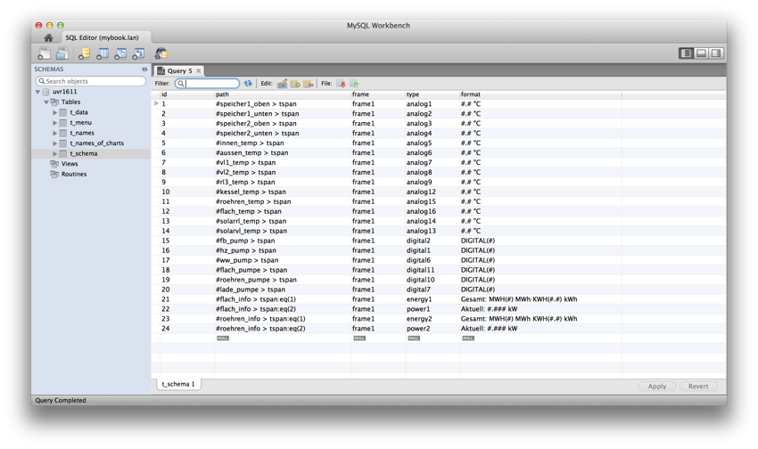

Darstellung der Pumpen- und Mischerzustände
------

Ab Version v0.90 lassen sich jetzt auch die Pumpen-, Mischer- und Ventilzustände im Diagramm darstellen, wenn diese entsprechend in den Tabellen `t_schema` und `t_names_of_charts` definiert worden sind. Die grafische Darstellung erfolgt in einem eigenen Diagramm oberhalb der "üblichen" Charts, wenn nicht komplett separat in `t_menu` als Chart definiert.

Screenshots
------

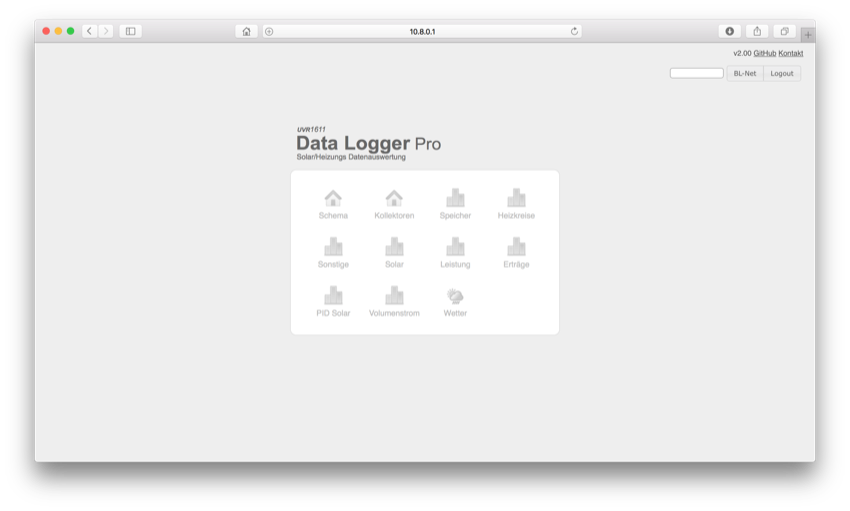

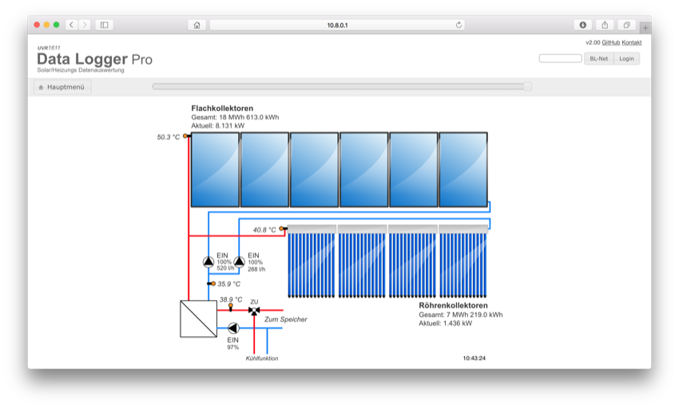

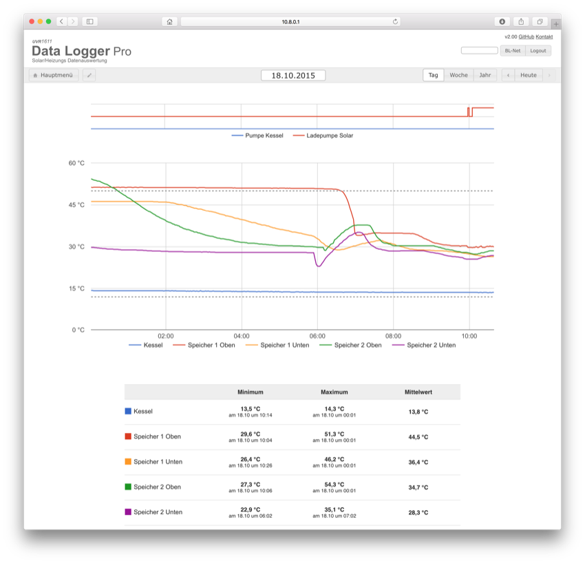

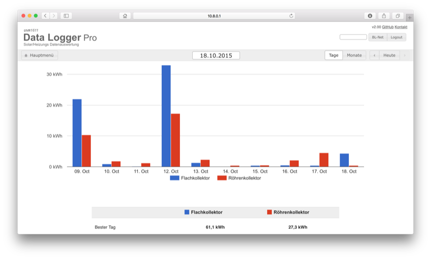

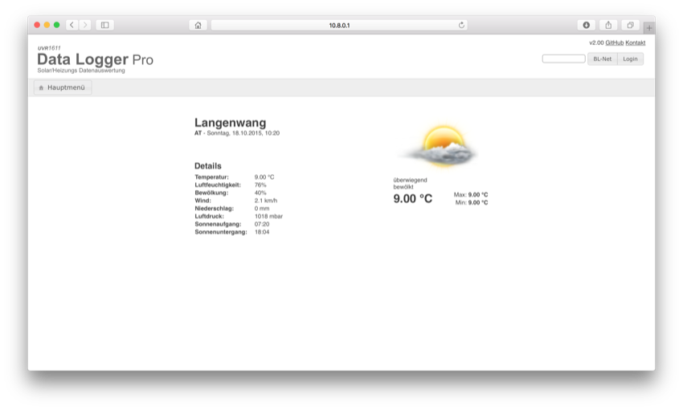

Kontakt
------
Bertram Winter (als Autor der Originalversion)
bertram.winter@gmail.com

Nicolai Emig 
nicolai@emig.me
